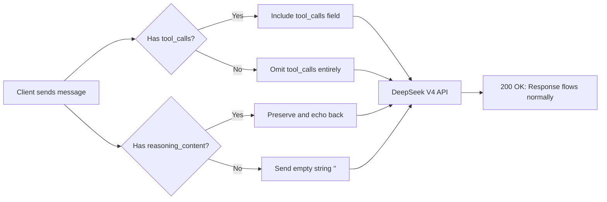
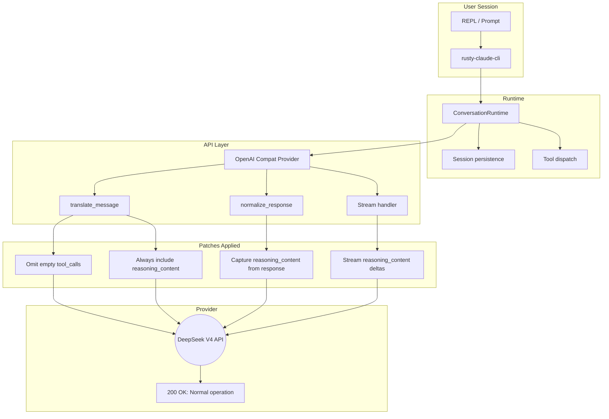
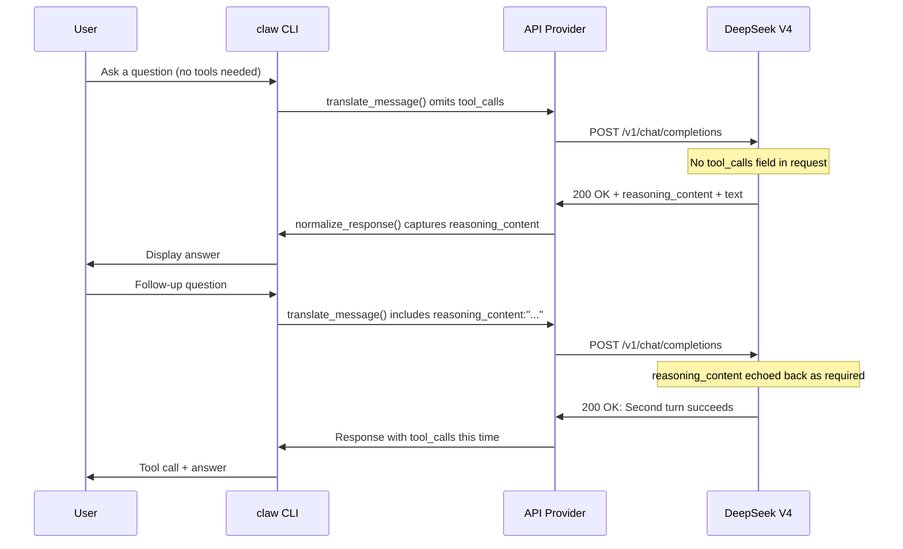

# DeepSeek V4 Compatibility Fix

**Fix 400 Bad Request errors when using DeepSeek V4 (and other strict OpenAI-compatible providers) with your AI coding agent.**

No more crashes on turn 2. No more empty `tool_calls` rejection. No more missing `reasoning_content` failures. Two targeted patches, one clean integration.

---

## What This Fixes

DeepSeek V4 Pro and Flash models enforce two API contract strictnesses that standard OpenAI-compatible clients (including `claw`) don't handle:

### 1. Empty `tool_calls` rejection

```json
400 Bad Request: Invalid 'messages[N].tool_calls': empty array.
Expected an array with minimum length 1, but got an empty array instead.
```

**When:** The model responds with text only and no tool calls. The client sends `"tool_calls": []` — DeepSeek (and NVIDIA NIM) reject it.

### 2. Missing `reasoning_content` passthrough

```json
400 Bad Request: The reasoning_content in the thinking mode must be
passed back to the API.
```

**When:** DeepSeek V4 returns `reasoning_content` in every response (thinking mode). On the next turn, the client must echo it back — even as an empty string `""`. Missing it triggers a 400.

Both errors surface on the **second turn** of any conversation — that is, as soon as a back-and-forth happens.

---

## The Fix (Two Patches, One Surface)



### Patch 1: Omit empty `tool_calls` array

**File:** `rust/crates/api/src/providers/openai_compat.rs`

Conditionally include the `tool_calls` field only when non-empty. The JSON serialization simply omits the key when there are no tool calls — which every OpenAI-compatible provider accepts.

```rust
// Before: always sent "tool_calls": [] — rejected by strict providers
// After: only sends tool_calls when non-empty
if !tool_calls.is_empty() {
    msg.insert("tool_calls", json!(tool_calls));
}
```

### Patch 2: Preserve `reasoning_content` bidirectionally

**Files modified across 5 crates:**

| Crate | File | Change |
|-------|------|--------|
| `api` | `types.rs` | Add `ReasoningContent` to `InputContentBlock` / `OutputContentBlock` |
| `api` | `providers/openai_compat.rs` | Capture from response, include in request, handle streaming deltas |
| `runtime` | `conversation.rs` | Add `AssistantEvent::Reasoning` variant |
| `runtime` | `session.rs` | Add `ContentBlock::Reasoning` variant |
| `runtime` | `compact.rs` | Handle new block type during compaction |
| `tools` | `lib.rs` | Handle `ReasoningContent` blocks in tool dispatch |
| `rusty-claude-cli` | `main.rs` | Convert `Reasoning` events to display blocks |

The key logic in `translate_message()`:

```rust
// DeepSeek V4 requires reasoning_content to be passed back
// Always include it (even empty) for assistant messages
msg.insert("reasoning_content", json!(reasoning_content));
```

And the streaming handler captures `reasoning_content` from chunk deltas and emits `ContentBlockStart` / `ContentBlockDelta` events so the runtime never loses track of it.

---

## Architecture



---

## Getting Started

### Prerequisites

- Rust toolchain 1.70+
- DeepSeek API key (or any strict OpenAI-compatible provider)

### Build

```bash
git clone https://github.com/nerudek/deepseek-v4-compatibility-fix.git
cd deepseek-v4-compatibility-fix/rust
cargo build --release
```

The binary is at `rust/target/release/claw`.

### Configure

```bash
export OPENAI_API_KEY="sk-your-deepseek-key"
export OPENAI_BASE_URL="https://api.deepseek.com/v1"
```

### Run

```bash
# Interactive REPL with DeepSeek V4
claw --model deepseek-chat

# One-shot prompt
claw --model deepseek-chat "list the files in this project"
```

---

## Tested Models

| Model | Status | Notes |
|-------|--------|-------|
| `deepseek-chat` (V4) | Verified | Full reasoning support |
| `deepseek-v4-pro` | Verified | Reasoning + tool calls |
| `deepseek-v4-flash` | Verified | Faster, cheaper variant |
| `deepseek-reasoner` (V3) | Verified | Legacy format, also works |
| NVIDIA NIM | Expected | Same strict validation pattern |

---

## Files Changed

```
rust/crates/api/src/providers/openai_compat.rs   (main patch surface)
rust/crates/api/src/types.rs                      (new block types)
rust/crates/runtime/src/conversation.rs           (event variant)
rust/crates/runtime/src/session.rs                (block variant)
rust/crates/runtime/src/compact.rs                (compaction support)
rust/crates/tools/src/lib.rs                      (block handling)
rust/crates/rusty-claude-cli/src/main.rs          (display conversion)
```

---

## How It Works, Step by Step



---

## Limitations

- The fix targets the `api` crate's OpenAI-compatible provider — it does not affect the Anthropic-native client path.
- Providers that ignore `reasoning_content` (most non-DeepSeek endpoints) see no behavioral change — the field is harmless when unrecognized.
- The `claw` binary name is a holdover from the upstream project. It has no relation to any other project of the same name.

---

## Related

- [Upstream issue: ultraworkers/claw-code#2821](https://github.com/ultraworkers/claw-code/issues/2821)
- [Related: zeroclaw-labs/zeroclaw#6298](https://github.com/zeroclaw-labs/zeroclaw/issues/6298)

---

## License

MIT
